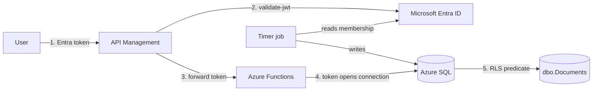

# Row-level authorization in Azure SQL driven by Microsoft Entra groups

Every row names the Entra security group allowed to read it and the group allowed
to change it. The database enforces that, not the application.

The signed-in user's own token opens the database connection, so Azure SQL
authenticates the end user directly. The API sends no identity and no group
membership, and has nothing it could spoof.

Deploy it into your own subscription, run the tests, read the benchmark numbers,
tear it down.

## Quick start

```bash
git clone <this-repository>
cd azure-sql-rls-entra-groups

az login
./setup.sh                 # asks for subscription, region and two demo users

cd infra
./deploy.sh --sql-only     # database only, a couple of minutes
```

`setup.sh` checks your tooling, validates what you enter, and tells you whether
you can create security groups in your directory. Nothing it saves is secret.

The database tier is enough to see everything except the gateway. Add the APIs
and API Management with `./deploy.sh` when you want the full path.

Requires the az CLI, the .NET SDK and `zip`. No `sqlcmd`.

## Running the demo

```bash
cd infra
./demo.sh
```

That prints who can read and write what, then runs the five enforcement tests.
It sorts out the token, the config and the firewall on its own.

```
User                Groups  Readable  Writable
------------------  ------  --------  --------
admin                  253     12600        50
demo-readwrite           2        50        50
demo-readonly            1        50         0

PASS  1. Alice sees 50 of 100000 rows (only her group).
PASS  2. Bob has no memberships and sees 0 rows.
PASS  3. BLOCK predicate stopped a write on a read-only row.
PASS  4. Security schema is not directly readable by the app role.
PASS  5. Deleting the membership row revoked access immediately.
```

The row worth pointing at is `demo-readonly`: 50 rows readable, none writable.
Same table, same query, same application code.

Other commands:

| Command | Shows |
| --- | --- |
| `./demo.sh access` | who can read and write what |
| `./demo.sh tests` | the five enforcement tests |
| `./demo.sh bench` | logical reads and timings |

## What gets created

In your subscription:

| Resource | Purpose | Cost |
| --- | --- | --- |
| Azure SQL server and database | The demo, Basic tier | Low |
| Storage account | Functions runtime | Negligible |
| App Service plan, B1 | Hosts both function apps | Low |
| Application Insights | Function logs | Negligible |
| Two function apps | REST and GraphQL | Included in the plan |
| API Management, Developer tier | Gateway and JWT validation | **The expensive one** |

In your directory, four security groups: `<component>-<environment>-alpha-read`,
`-alpha-write`, `-beta-read`, `-beta-write`.

That is four groups, not thousands. Scale is demonstrated with synthetic group
IDs in the database, because the predicate only compares GUIDs and cannot tell
the difference. Creating thousands of real directory objects would prove nothing
extra and would leave debris behind.

`./destroy.sh` removes all of it, including the four groups.

## Testing it

Every deploy runs two suites and fails if either does not pass.

**Verification**, 19 checks that the schema, policy, predicates, indexes and
permissions are actually in place:

```
Security policy enabled             PASS
FILTER predicate bound              PASS
BLOCK predicates bound              PASS    count=4
Security schema denied to app role  PASS
Documents seeded                    PASS    100000 rows
VERIFY PASSED: all checks green.
```

**Enforcement**, 5 tests that the policy does what it claims. These create
throwaway users, check them, and clean up:

```
PASS  1. Alice sees 50 of 100000 rows (only her group).
PASS  2. Bob has no memberships and sees 0 rows.
PASS  3. BLOCK predicate stopped a write on a read-only row.
PASS  4. Security schema is not directly readable by the app role.
PASS  5. Deleting the membership revoked access immediately.
```

Run them by hand at any time:

```bash
cd infra
source ./config.sh
export SQL_ACCESS_TOKEN=$(az account get-access-token \
    --resource https://database.windows.net --query accessToken -o tsv)

run_sql() {
    dotnet ./sqlrunner/bin/Release/net8.0/sqlrunner.dll \
        "${SQL_SERVER_NAME}.database.windows.net" "$SQL_DB_NAME" "$@"
}

run_sql ./sql/05_verify.sql        # 19 checks
run_sql ./sql/06_test_rls.sql      # 5 enforcement tests
run_sql ./sql/07_benchmark.sql     # logical reads and timings
run_sql ./sql/08_show_access.sql   # who can see what
```

`08_show_access.sql` is the one to look at first:

```
User                Groups  Readable  Writable
------------------  ------  --------  --------
admin                  253     12600        50
demo-readwrite           2        50        50
demo-readonly            1        50         0
```

The last row is the point. That user can see 50 documents and change none of
them. Same table, same query, same application code.

## Calling the APIs

```bash
cd infra && source ./config.sh
TOKEN=$(az account get-access-token \
    --resource https://database.windows.net --query accessToken -o tsv)

# Without the gateway
BASE="https://${FUNCAPP_REST}.azurewebsites.net/api"

# With the gateway, after a full deploy
BASE="https://${APIM_NAME}.azure-api.net/rest"

curl -s "$BASE/health"
curl -s "$BASE/my-access"      -H "Authorization: Bearer $TOKEN"
curl -s "$BASE/documents?take=5" -H "Authorization: Bearer $TOKEN"
curl -s "$BASE/documents/1"    -H "Authorization: Bearer $TOKEN"
```

Expected behaviour:

| Request | Result |
| --- | --- |
| `/health` without a token | 200 |
| `/documents` without a token | 401, rejected at the gateway |
| `/documents` with a token | 200, filtered by RLS |

`my-access` reports how the database identified you: database principal, Entra
object ID, synced group count, and how many rows you can see. It is the quickest
way to show that filtering follows identity.

GraphQL is at `/graphql` on the gateway, with an explorer if you open it in a
browser:

```bash
curl -s -X POST "https://${APIM_NAME}.azure-api.net/graphql" \
  -H "Authorization: Bearer $TOKEN" -H "Content-Type: application/json" \
  -d '{"query":"{ myAccess { databaseUser groupMembershipCount visibleDocumentCount } }"}'
```

There is also a browser client at `api-test-ui/index.html`. Open it, paste your
gateway URL and a token, and click through the endpoints.

```bash
python3 -m http.server 8080 --directory api-test-ui
```

## A note on who you are signed in as

Whoever deploys becomes the Entra admin of the SQL server, and an Entra admin
connects as `dbo`, which bypasses row-level security by design. So your own
account will see every row, and that is correct behaviour rather than a bug.

This is why `setup.sh` asks for two ordinary users. Filtering is only observable
when a non-admin signs in.

## Why membership is a table, not IS_MEMBER()

`IS_MEMBER()` is supported for Entra groups and is the obvious first answer. It
does not hold up when the number of groups is large.

| | `IS_MEMBER()` | Membership table |
| --- | --- | --- |
| Group must exist as a database principal | Yes, one `CREATE USER` per group | No |
| Index usable on the row's group column | No, scalar function per row | Yes |
| Membership freshness | Snapshot when the connection opens | Interval you choose |
| Revocation timing | Whenever the pooled connection recycles | The sync interval |

The first row decides it. `IS_MEMBER('name')` returns `NULL` unless SQL already
knows the group, which means `CREATE USER [group] FROM EXTERNAL PROVIDER` for
every group used on a row, maintained in step with the directory, in every
database. Azure SQL also requires unique principal names while Entra allows
duplicate display names, so collisions are certain rather than possible.

`IS_MEMBER()` remains the right tool for a small, stable set of groups.

### Limits worth knowing

All three are per user, and none are affected by how many groups exist in the
tenant.

| Limit | Value | Effect when exceeded |
| --- | --- | --- |
| Azure SQL login | 2,048 groups | The user cannot connect at all |
| Entra membership | 7,000 groups | Cannot be added to more groups |
| JWT `groups` claim | 200 groups | Claim omitted, overage claim instead |

The JWT limit does not apply here. Azure SQL resolves group membership itself
during login and does not read the `groups` claim, which is why group-based
database principals work with a plain `az account get-access-token`.

Sources: [Entra authentication limitations for Azure SQL](https://learn.microsoft.com/azure/azure-sql/database/authentication-aad-overview#limitations),
[IS_MEMBER](https://learn.microsoft.com/sql/t-sql/functions/is-member-transact-sql).

## How it works



Two independent paths meet in the database. The request path carries identity
only. The sync path carries membership only, on a schedule. Neither lets the API
assert what a user may see.

### The predicate

```sql
CREATE FUNCTION Security.fn_rowaccess (@group_id UNIQUEIDENTIFIER)
RETURNS TABLE
WITH SCHEMABINDING
AS
RETURN
    SELECT 1 AS fn_rowaccess_result
    WHERE EXISTS (
        SELECT 1
        FROM Security.UserIdentity AS u
        INNER JOIN Security.GroupMembership AS m
                ON m.UserObjectId = u.UserObjectId
        WHERE u.DatabasePrincipalId = DATABASE_PRINCIPAL_ID()
          AND m.GroupObjectId = @group_id
    );
```

`DATABASE_PRINCIPAL_ID()` is the identity on the authenticated connection. The
application cannot set it, forge it, or pass it.

### The policy

```sql
CREATE SECURITY POLICY Security.DocumentAccessPolicy
    ADD FILTER PREDICATE Security.fn_rowaccess(ReadGroupId)   ON dbo.Documents,
    ADD BLOCK  PREDICATE Security.fn_rowaccess(WriteGroupId)  ON dbo.Documents AFTER INSERT,
    ADD BLOCK  PREDICATE Security.fn_rowaccess(WriteGroupId)  ON dbo.Documents BEFORE UPDATE,
    ADD BLOCK  PREDICATE Security.fn_rowaccess(WriteGroupId)  ON dbo.Documents AFTER UPDATE,
    ADD BLOCK  PREDICATE Security.fn_rowaccess(WriteGroupId)  ON dbo.Documents BEFORE DELETE
WITH (STATE = ON, SCHEMABINDING = ON);
```

A FILTER predicate alone would let a user modify rows they are only entitled to
read, because the write path is not filtered.

## The sync job

A scheduled job asks Microsoft Graph for each user's transitive group membership
and writes it into SQL, so the database never calls Entra during a query.

```bash
cd infra
./sync-membership.sh          # the signed-in user
./sync-membership.sh --all    # every user in Security.UserIdentity
./sync-membership.sh <oid>    # specific users
```

It uses `getMemberObjects`, which returns transitive membership. `memberOf`
returns direct membership only and silently misses nested groups.

The merge replaces rather than appends, so a user removed from a group in Entra
loses access without any separate cleanup job. You can watch this: run
`08_show_access.sql`, then the sync, then run it again.

The interval is the one real trade-off. Adding someone to a group late is
harmless. Removing them late is a security window. Set the interval from your
revocation requirement.

`sync-membership.sh` uses your delegated Graph permissions through the az CLI, so
it needs no admin consent. In production this is a timer-triggered Function or
Logic App authenticating as a managed identity with `GroupMember.Read.All`, using
a delta query so only changes transfer.

## Measured results

Azure SQL Basic tier (5 DTU), 100,000 documents across 2,000 groups, test user in
250 groups, seeing 12,500 rows.

| Query | Documents | GroupMembership | UserIdentity | Elapsed |
| --- | --- | --- | --- | --- |
| Paged list, `TOP 50` | 6 reads | 100 | 100 | 0 ms |
| Single row by primary key | 3 reads | 2 | 2 | 0 ms |
| `COUNT(*)` over everything visible | 1,314 reads | 200,000 | 200,000 | 4,247 ms |

Read the third row honestly. The predicate is evaluated per candidate row, so a
full scan costs roughly two logical reads per row per entitlement table. Point
lookups and paged queries, which is what an API issues, are cheap. Whole table
aggregates are not, and should come from a summary table.

Basic tier is throttled at 5 DTU, so treat the reads-per-row shape as the
meaningful number rather than the wall clock.

One optimisation was considered and rejected. Keying `GroupMembership` on
`DatabasePrincipalId` would remove the `UserIdentity` lookup and halve the reads,
but database principal IDs can be reused after `DROP USER`, which would let a new
user inherit a deleted user's entitlements. The Entra object ID is the safer key.

## If your users connect differently

This design assumes the user's own token opens the database connection, whether
through the gateway or directly. That is what makes `DATABASE_PRINCIPAL_ID()`
trustworthy.

If your application connects with a shared service account or managed identity,
SQL only ever sees the application. The identity then has to be passed in:

```sql
EXEC sp_set_session_context 'UserObjectId', '<oid from the validated token>', @read_only = 1;
```

```sql
-- and the predicate line changes to
WHERE u.UserObjectId = CAST(SESSION_CONTEXT(N'UserObjectId') AS UNIQUEIDENTIFIER)
```

The entitlement table, the sync job and both policies are identical. What changes
is the trust boundary: the application becomes part of the security model,
because the database now believes what it is told.

## Repository layout

```
setup.sh                   Interactive first-run setup, writes infra/.env
infra/
  config.sh                Naming and tags, reads .env and the az session
  deploy.sh                Empty subscription to running demo
  destroy.sh               Removes the resource group and the Entra groups
  sync-membership.sh       The membership sync
  sqlrunner/               Runs .sql files with an Entra token, replaces sqlcmd
  sql/
    01_schema.sql          Business table and the entitlement tables
    02_rls_policy.sql      Predicate, policy, app role, dbo.vw_MyAccess
    03_procedures.sql      Procedures the sync job calls
    04_seed_demo_data.sql  Demo data, size set by setup.sh
    05_verify.sql          19 post-deployment assertions
    06_test_rls.sql        5 enforcement tests
    07_benchmark.sql       Logical reads and timings
    08_show_access.sql     Who can see what
graphql-server/            Azure Function, GraphQL via HotChocolate
rest-api/                  Azure Function, REST
api-test-ui/               Browser client
```

## Naming and tags

Resources follow `<abbreviation>-<component>-<environment>-<region>-<instance>`,
using the [Cloud Adoption Framework abbreviations](https://learn.microsoft.com/azure/cloud-adoption-framework/ready/azure-best-practices/resource-abbreviations).
Names needing global uniqueness use a short hash of the subscription ID instead
of the instance number, so a rebuild lands on the same names but two
subscriptions never collide.

Everything is tagged with `application`, `costCenter`, `criticality`,
`dataClassification`, `environment`, `lifecycle`, `managedBy`, `owner` and
`project`. Change them in `infra/config.sh`.

## Questions worth answering before adopting this

1. Do users reach SQL through your application or with their own connections,
   and whose credential opens the connection?
2. What does one group represent: a project, a tenant, a customer?
3. How many groups is a typical user in, and what is the maximum? Past 2,048 the
   user cannot connect.
4. How fast must a group removal actually revoke access?
5. Do groups nest? If so the sync must use transitive membership.
6. One database or several? The entitlement tables and the sync fan out per
   database.

If a group exists per business object, consider keeping a small number of Entra
groups for organisational roles and modelling fine-grained permissions as data in
SQL. Entra groups are built for organisational membership with governance, access
reviews and lifecycle, not for per-object ACLs.

## License

MIT. See [LICENSE](LICENSE).
